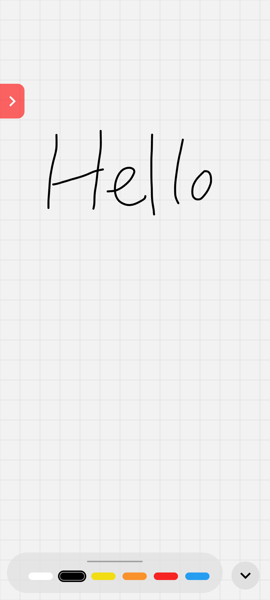
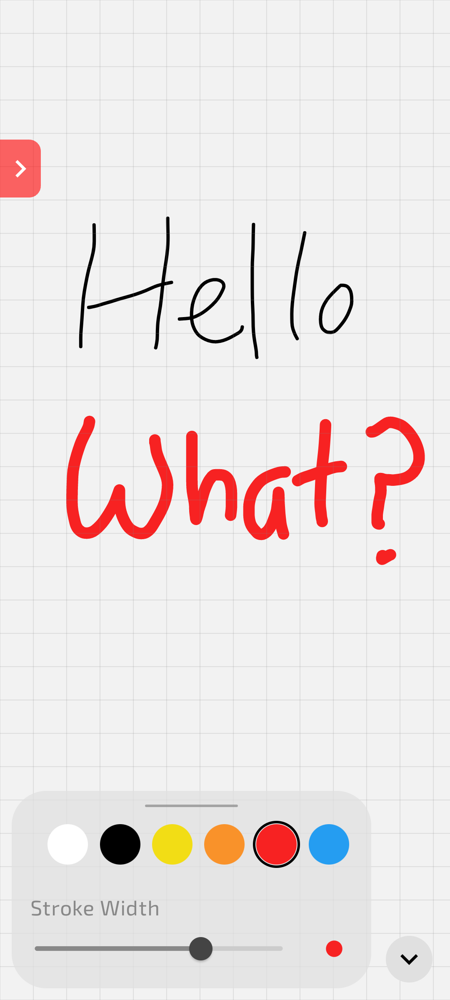
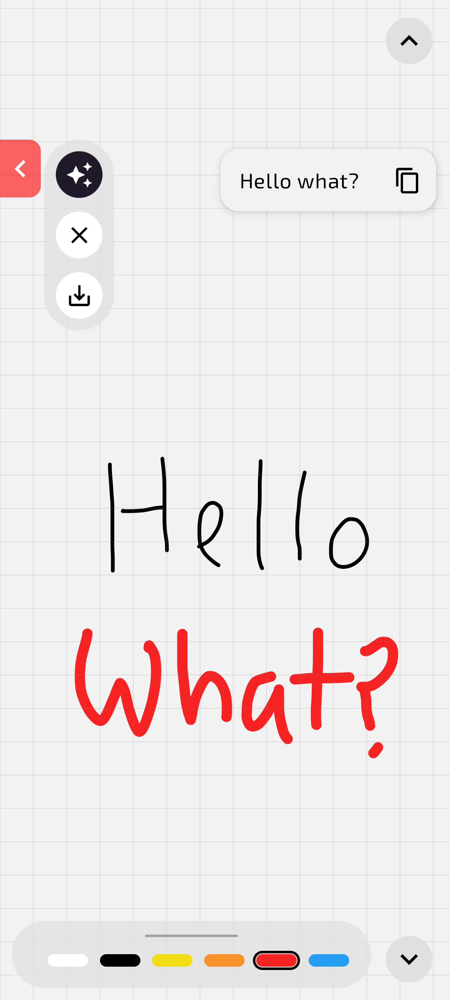
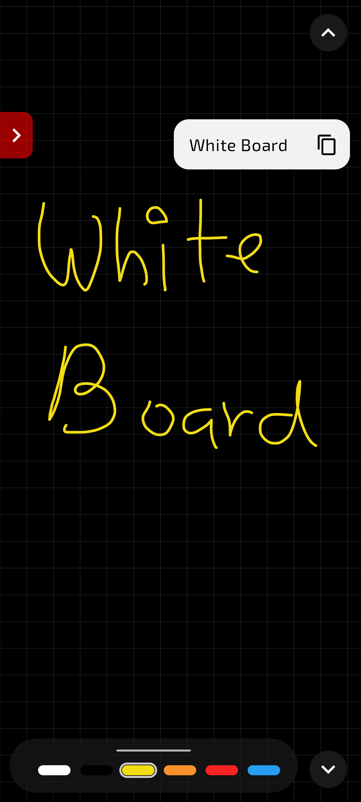
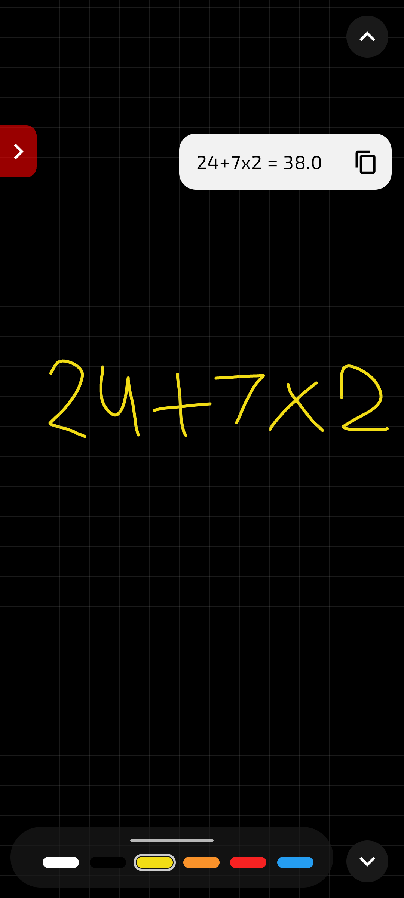

# WhiteBoard

WhiteBoard is a basic handwriting and drawing app built using Jetpack Compose. It lets users draw freely, recognize handwritten text, and save their work.

## UI

    
    
    

    
    

## Features

- Freehand drawing on canvas
- Color picker with toggle
- Adjustable stroke width
- Handwriting text recognition using ML Kit
- Save drawing as PNG image
- Supports Light and Dark modes

## How to Use

- Use your finger or stylus to draw on the canvas.
- Click the arrow icon to open tools for color and stroke width.
- Press "Recognize" to extract text from your handwriting.
- Press "Save" to store your drawing in internal storage.

